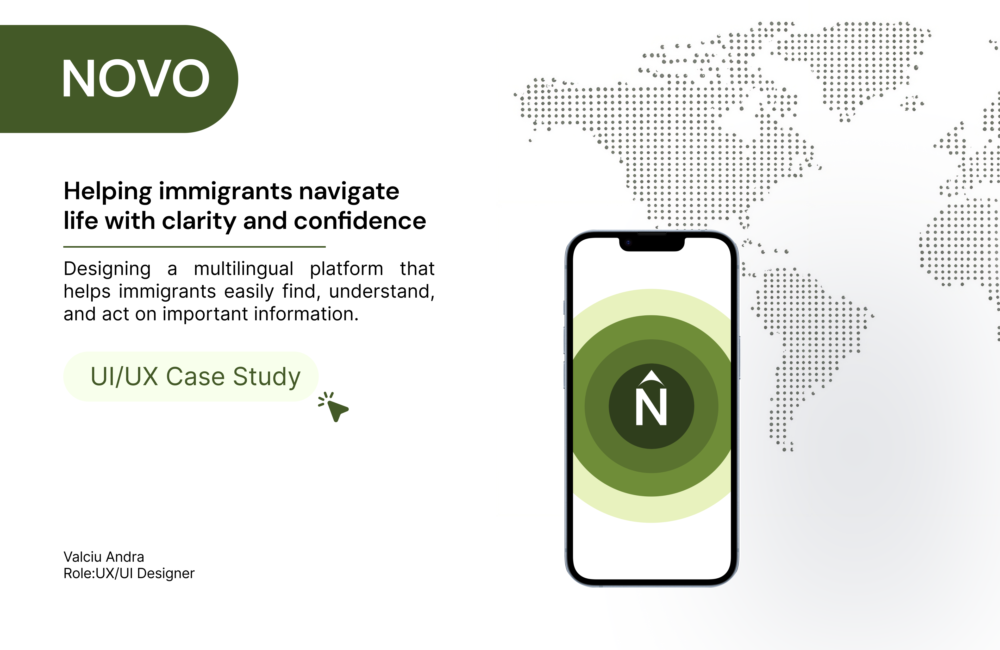
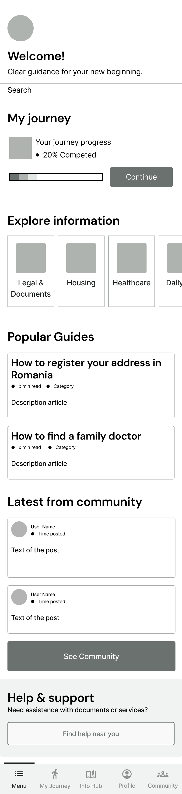
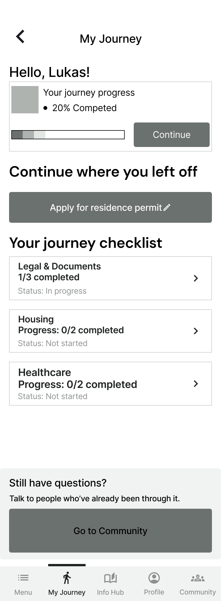
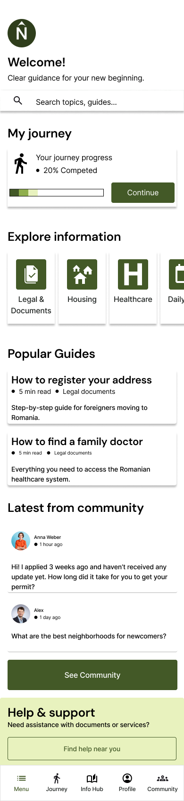
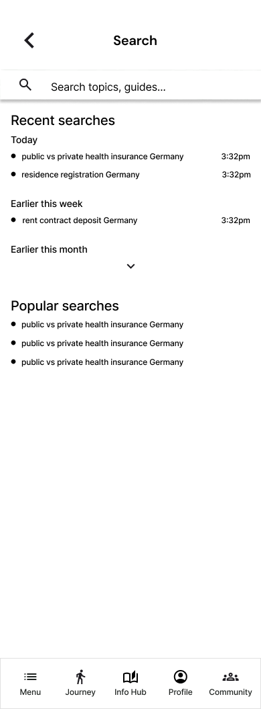

# Novo – UX/UI Case Study

## Overview

Novo is a UX/UI case study for a mobile application designed to help immigrants access clear, reliable, and structured information during relocation and integration.

The project focuses on reducing confusion caused by fragmented information sources, language barriers, and difficult-to-navigate official platforms.

---

## Problem

Many immigrants rely on scattered and often unreliable information from:

- social media groups
- forums
- unofficial recommendations
- complex government websites

This creates confusion, stress, and uncertainty in high-stakes situations involving:

- legal documents
- healthcare
- housing
- daily life
- social integration

---

## Solution

Novo aims to centralize essential information in one place through a more accessible and user-friendly experience.

The app focuses on:

- structured navigation
- personalized onboarding
- step-by-step guidance
- search functionality
- progress tracking
- community support

---

## UX Process

### Research

- User interviews
- Pain point analysis
- Problem definition

### Ideation

- How Might We questions
- Brainstorming
- User flows

### Design

- Mid-fidelity wireframes
- High-fidelity UI
- Design system
- Interactive prototype

### Testing

- Usability testing
- Iterative improvements

---

## Tools Used

- Figma

---

## Preview

### Cover

### Mid-Fidelity Wireframes

### High-Fidelity Screens

---

## Full Case Study

The complete case study PDF is available in this repository:

[Open PDF](./case-study.pdf)
